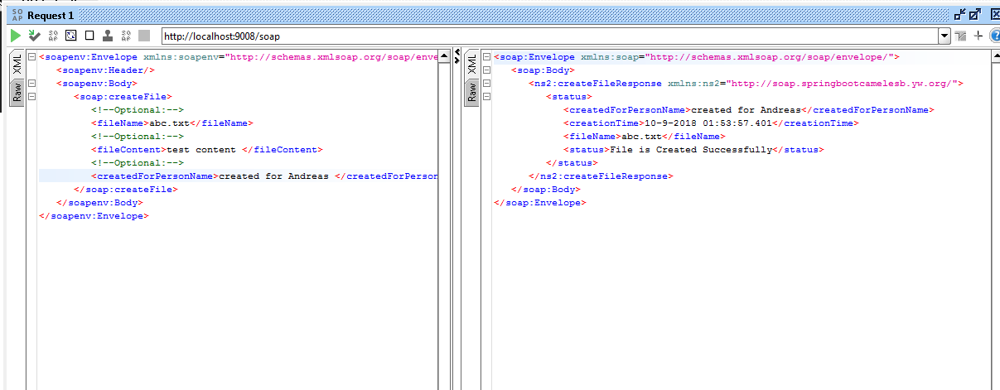
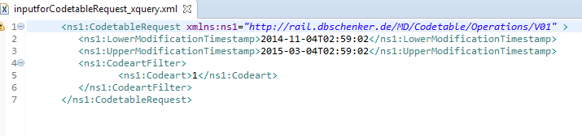
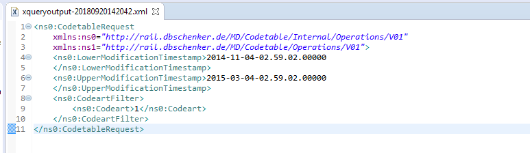

# SpringBoot + Apache Camel ESB Example 

This example shows how to work with a simple Apache Camel application using Spring Boot.

The example contains Camel routes

The Camel route is located in the `CamelRouteBuilder` class.  It defines routes below

- SOAP to File
- Xml input to XQuery to Xml output


### How to run

You can run this example using

`mvn spring-boot:run` 

or

`gradle bootRun`


### To get health check

To show a summary of spring boot health check

```
curl -XGET -s http://localhost:8080/actuator/health
```

### To get info about the routes

To show a summary of all the routes

```
curl -XGET -s http://localhost:8080/actuator/camelroutes
```

To show detailed information for a specific route

```
curl -XGET -s http://localhost:8080/actuator/camelroutes/{id}/detail
```


- Test result for Route SOAP to File 




- Test result for Route Xml input file to XQuery to Xml output  

  input xml 

   

  output xml 

  

  

  


## Reference

- https://www.youtube.com/watch?v=aA4tfBGY6jY 
- https://www.baeldung.com/apache-camel-spring-boot 
- https://itnext.io/migrating-a-spring-boot-service-to-kubernetes-in-5-steps-7c1702da81b6
- https://spring.io/guides/gs/spring-boot-docker/
- http://camel.apache.org/spring-boot.html
- https://www.baeldung.com/apache-camel-spring-boot
- https://medium.com/@mzimecki/spring-boot-apache-camel-web-service-a90696d8ac36  